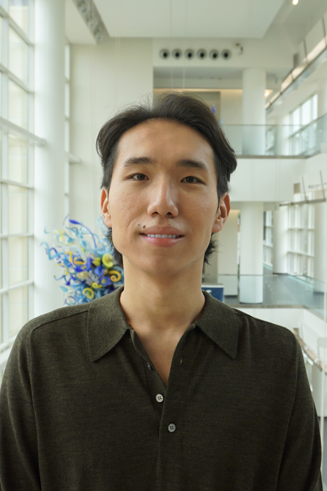

          
---

# Welcome to my website! I am Rakhat Nurgali  
I’m currently pursuing a **Bachelor of Science in Business Administration – Finance** at **Georgia Institute of Technology**, with a **FinTech concentration** and a **minor in Computer Science**. I'm passionate about financial modeling, market research, and applying data analytics in investment decision-making.  

* __Profile__: [**Link to my CV**](RakhatCV.pdf)     
* __Email__: [rnurgali3@gatech.edu](mailto:rnurgali3@gatech.edu)  
* __LinkedIn__: [https://www.linkedin.com/in/rakhatnurgali](https://www.linkedin.com/in/rakhatnurgali)  
* __GitHub__: [https://github.com/rakhatnurgali](https://github.com/rakhatnurgali)  

## Career Interests:
__Primary__: Investment Banking, FinTech, Financial Modeling  
__Secondary__: Data Analytics, Strategic Finance, Capital Markets  

## Academic Highlights:
- Interned at **Kaspi Bank** and **Asyl Logistics** with hands-on experience in financial modeling, M&A pitch books, and scenario analysis.  
- Participated in a **Stanford University research program**, where I improved investment portfolios using real-time financial analysis.  
- Member of **Georgia Tech Solar Racing**, managing $200K+ budget and increasing sponsorships by 40%.

## Notable Skills & Certifications:
- **Technical Tools:** Excel, Python, SQL, Bloomberg, PowerBI  
- **Languages:** English, Russian, Kazakh, Ukrainian, French  
- **Certifications:** CFA Level I Candidate, CPA Candidate  

# Highlight Project: Georgia Tech Solar Racing  

  
As Financial Analyst & Advisor, I led funding initiatives that secured over $200K in sponsorships, including a major deal with Delta Airlines. By optimizing budget allocations and prioritizing critical design testing, the team achieved over 35% performance improvement.  
My contribution helped elevate the team’s national profile in renewable energy innovation and competitive engineering.


  

  

